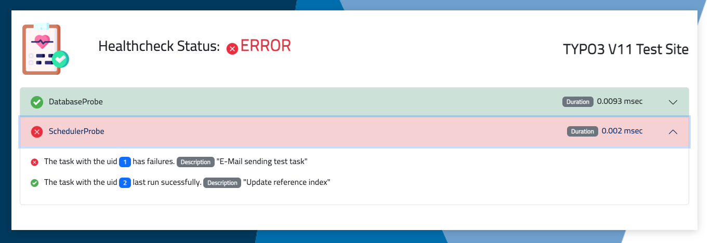

<!-- omit in toc -->
# TYPO3 extension: "healthcheck"

Version: 0.7.3

<!-- omit in toc -->
## Content
- [What does it do?](#what-does-it-do)
- [Installation](#installation)
- [Accessing the healthcheck](#accessing-the-healthcheck)
- [Returned HTTP status code](#returned-http-status-code)
- [Configuration](#configuration)
  - [Extension configuration](#extension-configuration)
  - [TypoScript configuration](#typoscript-configuration)
- [Probes](#probes)
  - [CacheProbe](#cacheprobe)
  - [DatabaseProbe](#databaseprobe)
  - [SchedulerProbe](#schedulerprobe)
- [Outputs](#outputs)
  - [HtmlOutput](#htmloutput)
- [Customization](#customization)
  - [Add custom probes](#add-custom-probes)
  - [Add custom outputs](#add-custom-outputs)
- [Inspiration](#inspiration)
- [Used resources](#used-resources)

## What does it do?
The TYPO3 extension **"healthcheck"** provides various outputs, each showing healthcheck informations for the current TYPO3 installation. To do so, the extension runs various probes. According to each single probe result (Success or Error) an overall Healthcheck result is generated. The healthcheck output may be used by a variety of monitoring software like **PRTG**. 



## Installation
The extension is installable using Composer:
```bash
composer req worlddirect/healthcheck
```
> **ATTENTION:** You need to configure the **"secret"** in order for the healthcheck to work. See [Extension configuration](#extension-configuration) for details.

## Accessing the healthcheck
The **Healthcheck** uses a Middleware to render the output. In order for the Middleware to know that a possible healthcheck needs to be rendered, we use the extension configuration settings **pathSegment** and **secret**. As well as the output type.

The healthcheck can be accessed by a "path" using 3 parts. Here is an example URL:
https://www.mustermann.de/healthcheck/lkjl23wsdkjjlskdj/html/.
- **1. part:** The first of the "path" is the *"pathSegment"*. In the example this is **"healthcheck"**.
- **2. part:** The second part of the "path" is the "*secret*". The example contains the secret **"lkjl23wsdkjjlskdj"**. 
- **3. part:** The third and final part of the "path" contains the name of the desired Output. In this case it uses "html" which represents the **"HtmlOutput"**. If this part is omitted, the default "html" is used.

## Returned HTTP status code
The returned response status code depends on the status of the HealthcheckResult object. If the status equals an **"ERROR"** a http status code `503` is returned. If the status is a **"SUCCESS"** a code of `200` is returned. This makes it possible to check for the http status code in order to determine if there is a problem with the healthcheck. No need to interpret the output. There are tools, as mentioned before which can perform checks for a specific HTTP status code. Or you build your own litte script to do so. :smiley:

## Configuration
There is an extension configuration as well as a TypoScript settings configuration.

### Extension configuration
The extension configuration holds various settings, which need to be set in order for the healthcheck to work. Also showing debugging informations can be enabled.

**pathSegment:** This setting sets the 1. part of the "path" used to access the healthcheck. It's default setting is **"healthcheck"** and may be adapted by the user.

**secret:** As the output of the healthcheck is considered an information worthy to protect, setting a secret value is mandatory. Without it will not work and will not show an output. In the default settings there is no secret, which forces the administrator of the site to create one.

**allowedIps:** It is possible to limit the allowedIps which may view the healthcheck. Default value is **"*"** (every IP address).

**enableDebug:** This setting allows to output some more debugging information. E.g.: If you do not set a *secret*, the healthcheck will not show anything in the frontend. If you enable the **"enableDebug"** setting you will at least see a short message about the current error. Default value is **"off"** (0).

### TypoScript configuration
The TypoScript configuration is used for any other settings. Currently there is only one setting for the HTML output.

**backgroundImage:** This setting is relevant for the HTML output and contains the background image to use for the HtmlOutput class instance.

## Probes

In order to check for certain functionality, data or states we use **Probes** to do so. These probes have a **"run"** method which checks certain stuff, and fills the probe's result with *success* or *error* messages. If there is at least 1 *error* message the overall status of the *HealthcheckResult* is *ERROR*. 

> All probes need to have the status "SUCCESS" for the overall HealthcheckResult Status to be "SUCCESS"!

The extension already provides three probes out of the box:
- **CacheProbe:** Checks if all cache configurations are writeable
- **DatabaseProbe:** Checks if the access to the database works
- **SchedulerProbe:** Check if there are any scheduled tasks, which have a failure

### CacheProbe
TODO: What is the CacheProbe?

### DatabaseProbe
TODO: What is the DatabaseProbe?

### SchedulerProbe
TODO: What does the SchedulerProbe do?

## Outputs
TODO: What is a output?

The extension provides these output formats out of the box:
- **HtmlOutput:** Renders a HTML page using Bootstrap 5 to display the HealthcheckResult. Showing a overall Success or Error.
- **JsonOutput:** Simple JSON output which displays the HealthcheckResult as JSON.

### HtmlOutput
TODO: How does the HtmlOutput work?

## Customization

This extension is customizable in a way, that allows the developer to add new **probes** as well as **outputs**.

### Add custom probes
TODO: Explain Interface
TODO: Explain BaseClass

### Add custom outputs
TODO: Explain Interface
TODO: Explain BaseClass

## Inspiration

This extension was inspired by the GitHub Gist of **Axel Seemann** (aseemann). For details on the Gist see here: [healthcheck.php](https://gist.github.com/aseemann/42041fccb784cf472349a7af9748fe9b). Also did I take some ideas from the extension **t3monitoring_client** from **Ringer Georg**. For details on this extension see here: [t3monitoring_client](https://github.com/georgringer/t3monitoring_client).
## Used resources

The credit for the images goes to:
- success.png: <a href="https://www.flaticon.com/free-icons/tick" title="tick icons">Tick icons created by kliwir art - Flaticon</a>
- danger.png: <a href="https://www.flaticon.com/free-icons/error" title="error icons">Error icons created by Ilham Fitrotul Hayat - Flaticon</a>
- health-report.png: <a href="https://www.flaticon.com/free-icons/medical-record" title="medical record icons">Medical record icons created by Freepik - Flaticon</a>